<div style="background-color: #ccffcc; padding: 10px;">
    <h1> Tutorial 4 </h1> 
    <h2> Gaussian Processes </h2>
</div>    

## Overview


<div style="background-color: #ccffcc; padding: 10px;">

<h1> Gaussian Processes </h1>

This tutorial is based on work done by Ollie Pollard on using Gaussian Processes to predict sea level rise. Following the steps outlined in this [visual article](https://distill.pub/2019/visual-exploration-gaussian-processes/). Gaussian processes are often used to make predictions about our data by incorporating prior knowledge often to fit a function to a data set. For a given set of training points, there are potentially infinitely many functions that fit the data. Gaussian processes offer an elegant solution to this problem by assigning a probability to each of these functions. The mean of this probability distribution then represents the most probable characterization of the data.


    
## Recommended reading

* [Overview of Linear Regression](https://towardsdatascience.com/linear-regression-detailed-view-ea73175f6e86)
* [An Intuative Guide to Gaussian Processes](https://towardsdatascience.com/an-intuitive-guide-to-gaussian-processes-ec2f0b45c71d)
    
</div>


<hr>


<div style="background-color: #e6ccff; padding: 10px;">
    
<h1> Machine Learning Theory </h1>
    
<a href="https://distill.pub/2019/visual-exploration-gaussian-processes/">
                
</a>
    
This tutorial is mainly focusing on using python to explore Gaussian Processes. Please read the full [visual aritcle](https://distill.pub/2019/visual-exploration-gaussian-processes/) for a more in depth explanation.
    
The [gaussian distribution](https://en.wikipedia.org/wiki/Normal_distribution) forms the building blocks of Gaussian Processes.
   $\displaystyle f(x) ={\frac {1}{\sigma {\sqrt {2\pi }}}}e^{-{\frac {1}{2}}\left({\frac {x-\mu }{\sigma }}\right)^{2}}$
 
<a href="https://distill.pub/2019/visual-exploration-gaussian-processes/">
    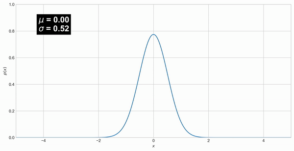
</a>

For Machine Learning Gaussian Processes we are interested in the [multivariate case](https://en.wikipedia.org/wiki/Multivariate_normal_distribution). The multivariate Gaussian distribution is defined by a mean vector $\mu$ (the expected value of the distribution) and a covariance matrix $\Sigma$. $\Sigma$ models the variance along each dimension and determines how the different random variables are correlated. If $X$ follows a normal distribution:
    
\begin{equation} X = \begin{bmatrix} X_1 \\ X_2 \\ \vdots \\ X_n \end{bmatrix} \sim \mathcal{N}(\mu, \Sigma) \end{equation}
 
The covariance matrix $\Sigma$ describes the shape of the distribution. It is defined in terms of the expected value $E$
    
\begin{equation}    
\Sigma = \text{Cov}(X_i, X_j) = E \left[ (X_i - \mu_i)(X_j - \mu_j)^T \right]
\end{equation}
 
Gaussian distributions have the nice algebraic property of being closed under conditioning and marginalization. Being closed under conditioning and marginalization means that the resulting distributions from these operations are also Gaussian, which makes many problems in statistics and machine learning tractable.
Marginalization and conditioning both work on subsets of the original distribution and we will use the following notation:

\begin{equation}
P_{X,Y} = \begin{bmatrix} X \\ Y \end{bmatrix} \sim \mathcal{N}(\mu, \Sigma) = \mathcal{N} \left( \begin{bmatrix} \mu_X \\ \mu_Y \end{bmatrix}, \begin{bmatrix} \Sigma_{XX} \, \Sigma_{XY} \\ \Sigma_{YX} \, \Sigma_{YY} \end{bmatrix} \right)   
\end{equation}

With $X$ and $Y$ representing subsets of original random variables.   
Through marginalization we can extract partial information from multivariate probability distributions. In particular, given a normal probability distribution $P(X,Y)$ over vectors of random variables $X$ and $Y$, we can determine their marginalized probability distributions in the following way:
    
\begin{equation}
\begin{aligned}
X \sim \mathcal{N}(\mu_X, \Sigma_{XX}) \\
Y \sim \mathcal{N}(\mu_Y, \Sigma_{YY})
\end{aligned}
\end{equation}    
    
The interpretation of this equation is that each partition $X$ and $Y$ only depends on its corresponding entries in $\mu$ and $\Sigma$. To marginalize out a random variable from a Gaussian distribution we can simply drop the variables from $\mu$ and $\Sigma$.
    
\begin{equation}  
p_X(x) = \int_y p_{X,Y}(x,y)dy = \int_y p_{X|Y}(x|y) p_Y(y) dy
\end{equation}
    
The way to interpret this equation is that if we are interested in the probability density of $X=x$, we need to consider all possible outcomes of $Y$ that can jointly lead to the result.

Another important operation for Gaussian processes is conditioning. It is used to determine the probability of one variable depending on another variable. Similar to marginalization, this operation is also closed and yields a modified Gaussian distribution. This operation is the cornerstone of Gaussian processes since it allows Bayesian inference. Conditioning is defined by:
    
\begin{equation}     
\begin{aligned}
X|Y \sim \mathcal{N}(\:\mu_X + \Sigma_{XY}\Sigma_{YY}^{-1}(Y - \mu_Y),\: \Sigma_{XX}-\Sigma_{XY}\Sigma_{YY}^{-1}\Sigma_{YX}\:) \\
Y|X \sim \mathcal{N}(\:\mu_Y + \Sigma_{YX}\Sigma_{XX}^{-1}(X - \mu_X),\: \Sigma_{YY}-\Sigma_{YX}\Sigma_{XX}^{-1}\Sigma_{XY}\:) \\
\end{aligned}
\end{equation}

The new mean only depends on the conditioned variable, while the covariance matrix is independent from this variable.

</div>    
 


  
<div style="background-color: #cce5ff; padding: 10px;">

<h1> Python </h1>

## Tensorflow and GPflow
    
There are many machine learning python libraries available, [TensorFlow](https://www.tensorflow.org/) a is one such library. Throughout this tutorial, you will see some complex machine learning tasks executed in just a few lines of code by calling [GPflow](https://gpflow.readthedocs.io/en/master/) functions which use Tensor flow. If you have GPUs on the machine you are using, these python libraries will automatically use them and run the code even faster!

## Further Reading
    
* [GPflow example Notebooks](https://gpflow.readthedocs.io/en/develop/notebooks_file.html)

</div>
    
<hr>

<div style="background-color: #ffffcc; padding: 10px;">
    
<h1> Requirements </h1>

These notebooks should run on a standard laptop with the correct python environment.

<h2> Python Packages: </h2>

* Python 3.8
* tensorflow > 2.1
* gpflow 2.1 *(must be installed via pip to get latest version)*
* numpy 
* matplotlib
* plotly
* scipy
* pandas


<h2> Data Requirements</h2>
    
This notebook referes to some data included in the git hub repositroy in the [data](data) folder
    
</div>


**Contents:**

1. [Overview of Gausian Processes](#Overview-of-Gausian-Processes)
2. [Sea Level Example](#Sea-Level-Example)
1. [Load Data](#Load-Data)
2. [Normalise Data](#Normalise-Data)
3. [Plot Data](#Plot-Data)
4. [Define GP flow model](#Define-GP-flow-model)
5. [Optamization](#Optamization)
6. [Prediction](#Prediction)
7. [Cross Validation](#Cross-Validation)
8. [Plot High Stands](#Plot-High-Stands)


<div style="background-color: #cce5ff; padding: 10px;">
    
Load in all required modules and turn off warnings. If you have no [GPU's](https://www.analyticsvidhya.com/blog/2020/09/why-gpus-are-more-suited-for-deep-learning/) available you may see some tensor flow warnings

</div>


```python
# For readability: disable warnings
import warnings
warnings.filterwarnings('ignore')
```


```python
# import modules
import gpflow
import tensorflow as tf
import numpy as np
import matplotlib.pyplot as plt
import plotly.express as px
from gpflow.utilities import print_summary
from scipy.spatial.distance import cdist
from scipy.stats import multivariate_normal

gpflow.config.set_default_summary_fmt("notebook")
plt.style.use("seaborn-whitegrid")
```

    2021-08-06 17:04:30.047070: W tensorflow/stream_executor/platform/default/dso_loader.cc:64] Could not load dynamic library 'libcudart.so.11.0'; dlerror: libcudart.so.11.0: cannot open shared object file: No such file or directory
    2021-08-06 17:04:30.047093: I tensorflow/stream_executor/cuda/cudart_stub.cc:29] Ignore above cudart dlerror if you do not have a GPU set up on your machine.


# Overview of Gausian Processes

<div style="background-color: #ccffcc; padding: 10px;">

Say we want to find an unknown function `y` where $y = x^3 - 9x + e^{(x^3/30)}$ from a random sample of points [`x_samp`, `ysamp`]
    
**NB function `y` is chosen at random for demonstative purposes you can change `y` to what ever you like and see similar results!**
    

</div>

<div style="background-color: #ccffcc; padding: 10px;">

 
After you've ran throught the code you might want to re run with a different choice of `y`     
    
</div>


```python
# some function y that we're going to try and find
# set x to between -6 and 6
x = np.linspace(-6,6,100)
# A random function chosem
y = x**3 - 9*x + np.exp(x**3/30)
```

# generate sample


```python
# a random sample of points
# whole x range is between -6 and 6 and we'll sample x between -2 and 2 
sample_size = 5

samp_index = np.random.randint((len(x)-1)/4, high=(len(x)-1)*3/4, size=sample_size)
```

<div style="background-color: #ccffcc; padding: 10px;">

Later if you wish you can uncomment the below cell to see the effects of changing the sample size or sample area (below is set to sample whole range with a sample size of 8)

</div>


```python
#sample_size = 8
#samp_index = np.random.randint(0, high=len(x), size=sample_size)
```

<div style="background-color: #cce5ff; padding: 10px;">
 
As we've take a random sample there's a small chance we might have sampled the same point twice so the below code is going to check we have 5 unique sample points    
    
</div>


```python
# Check no duplicates in sample index

if len(np.unique(samp_index)) != sample_size :
    print("duplicate sample index found please rerun above cell")
```


```python
samp_index
```


    array([25, 51, 70, 46, 45])


```python
x_samp = x[samp_index]
y_samp = y[samp_index]
# Plot Sample points
fig, ax = plt.subplots(figsize=(10,5))
point_c = "#f77f00"
ax.scatter(x_samp, y_samp, s=50, c=point_c, zorder=10)
ax.set_xlim([-6,6])
ax.set_xlabel("x")
ax.set_ylabel("f(x)")
```


    Text(0, 0.5, 'f(x)')


    
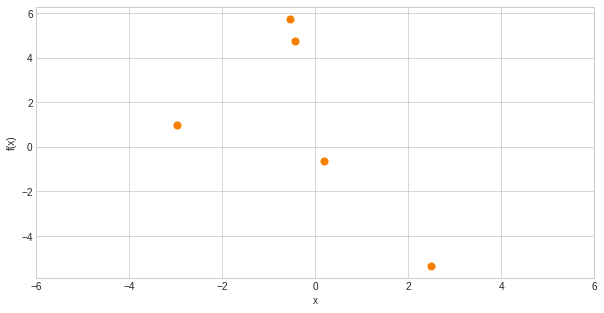
    


<div style="background-color: #ccffcc; padding: 10px;">

From these few points it's not obvious what function `y` could possibly be. So we can use Gaussian Processes to help work out the unknown function from these few points

The covariance matrix $\Sigma$ is determined by its covariance function $k$, which is often also called the kernel of the Gaussian process. Here we will use the [Radial Basis Function Kernal](https://towardsdatascience.com/radial-basis-function-rbf-kernel-the-go-to-kernel-acf0d22c798a):
    
\begin{equation}
 K(X_1,X_2) = exp(-{\frac{||X_1 - X_2|| ^2}{2\sigma^2}}) 
\end{equation}

where $\sigma$ is the variance and hyperparameter and $||X_1 - X_2|| ^2$ is the is the Euclidean distance between two points 
    
this is defined in the function `rbf_kernel`
</div>


```python
# radial basis function kernel
def rbf_kernel(x1, x2, var, lscale):
    """
        Compute the Euclidean distance between each row of X and X2, or between
        each pair of rows of X if X2 is None and feed it to the kernel.
     """
    if x2 is None:
        d = cdist(x1, x1)
    else:
        d = cdist(x1, x2)
    K = var*np.exp(-np.power(d,2)/(lscale**2))
    return K
```

<div style="background-color: #ccffcc; padding: 10px;">

so `K` can be obtained via `rbf_kernel` and $\mu$ `mu` is often assumed to be zero as a starting point
</div>

<div style="background-color: #cce5ff; padding: 10px;">

try adjusting `lscale` to see what happens with the results
e.g. after running through the first time set `lscale=5` and run through all cells again
    
Increasing the length parameter increases the banding, as points further away from each other become more correlated. 
    
</div>


```python
lscale = 1.0
K_rbf = rbf_kernel(x.reshape(-1,1), None, 1.0, lscale)
mu = np.zeros(x.shape[0])
f_rbf = np.random.multivariate_normal(mu, K_rbf, 100)
```


```python
rv = multivariate_normal(np.zeros(2), rbf_kernel(np.arange(0,2).reshape(-1,1), None, 1.0, 2.0))
```


```python
#Create grid and multivariate normal
a = np.linspace(-3,3,500)
b = np.linspace(-3,3,500)
X, Y = np.meshgrid(a,b)
pos = np.empty(X.shape + (2,))
pos[:, :, 0] = X
pos[:, :, 1] = Y
```

<div style="background-color: #ccffcc; padding: 10px;">

Stochastic processes, such as Gaussian processes, are essentially a set of random variables. In addition, each of these random variables has a corresponding index $i$. We will use this index to refer to the $i$-th dimension of our nnn-dimensional multivariate distributions.
    
Below, we have a two-dimensional normal distribution. Each dimension $y_i$ is assigned an index $\displaystyle{i \in {1,2}}$.  This representation allows us to understand the connection between the covariance and the resulting values: the underlying Gaussian distribution has a positive covariance between $y_1$ and $y_1$ -  this means that $y_2$ will increases as $y_1$ gets larger and vice versa. 
    
</div>


```python
grid = plt.GridSpec(1, 2, wspace=0.2, hspace=0.3)
fig = plt.figure(figsize=(10, 5))
ax1 = fig.add_subplot(grid[0, 0])
ax2 = fig.add_subplot(grid[0, 1])
ax1.contourf(X, Y, rv.pdf(pos), cmap="Reds", levels=300)
for index in range(10):
    rand_y1, rand_y2 = np.random.multivariate_normal(np.zeros(2), rbf_kernel(np.arange(0,2).reshape(-1,1), None, 1.0, 2.0), 1)[0]
    ax1.scatter(rand_y1, rand_y2)
    ax1.set_xlabel("$y_1$")
    ax1.set_ylabel("$y_2$")
    ax2.plot(np.arange(1,3), [rand_y1, rand_y2], '-o')
    ax2.set_xlim([0,3])
    ax2.set_ylim([-3,3])
    ax2.set_xlabel("index")
    ax2.set_ylabel("$y$")
    ax2.set_xticks([1,2])
```


    
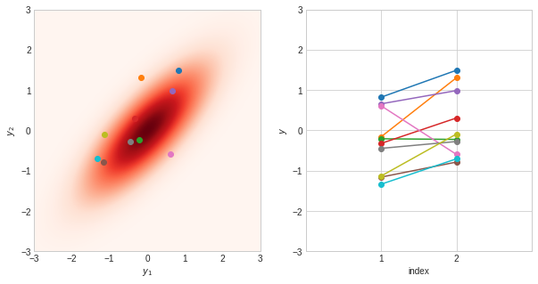
    


<div style="background-color: #ccffcc; padding: 10px;">
The more horizontal the lines are the more strongly correlated 
</div>


```python
# rbf_kernel(X1,X2,var,lscale)
rbf_kernel(np.arange(0,2).reshape(-1,1), None, 1.0, lscale)
```


    array([[1.        , 0.36787944],
           [0.36787944, 1.        ]])


<div style="background-color: #ccffcc; padding: 10px;">

## Prior distribution


The following figure shows samples of potential functions from prior distributions (the case where we have not yet observed any training data) that were created using RBF kernel
    
</div>


```python
var_index = np.linspace(0, 20,100)
fig, ax = plt.subplots(figsize=(10,5))
for index in range(10):
    ax.plot(var_index, np.random.multivariate_normal(np.zeros(var_index.shape[0]), rbf_kernel(var_index.reshape(-1,1), None, 1.0, 5.0), 1)[0])
    ax.set_xlim(0,20)
    ax.set_ylim(-3,3)
    ax.set_xlabel("$x$")
    ax.set_ylabel("$y$")
    ax.set_xticks([])
ax.set_title('GP samples from RBF where lscale ='+str(lscale))
```


    Text(0.5, 1.0, 'GP samples from RBF where lscale =1.0')


    
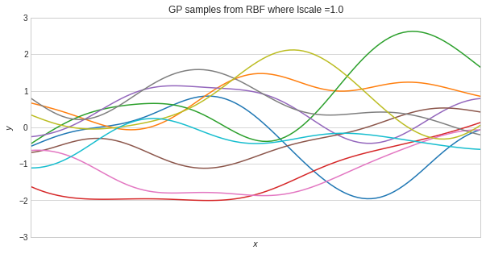
    


```python
# Covariance matrix from the RBF kernel
# rbf_kernel(X1,X2,var,lscale)
K_rbf = rbf_kernel(x.reshape(-1,1), None, 1.0, lscale)
# mu = 0
mu = np.zeros(x.shape[0])
# fuctions from rbf kernel
f_rbf = np.random.multivariate_normal(mu, K_rbf, 100)
```


```python
# plot 100 GP samples
index=100
fig, ax = plt.subplots(figsize=(10,5))
ax.plot(x, f_rbf.T[:,0:index], color='C0', alpha=0.2)
ax.set_xlim([-6,6])
# depending you you function choice you might need to comment out the ylim line below 
ax.set_ylim([-10,15])
ax.set_xlabel("x")
ax.set_ylabel("f(x)")
ax.set_title('100 GP samples from  RBF kernel where lscale ='+str(lscale))
```


    Text(0.5, 1.0, '100 GP samples from  RBF kernel where lscale =1.0')


    
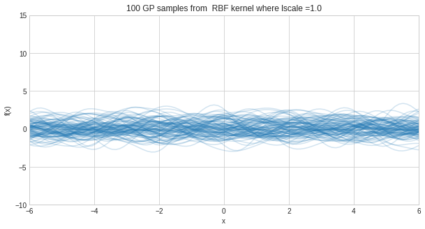
    


<div style="background-color: #ccffcc; padding: 10px;">
as $\mu$ is set to zero all functions are distributed normally around the mean $\mu$ (0)
</div>

<div style="background-color: #ccffcc; padding: 10px;">

## Posterior distribution

now we're going to activate training data which we can add back into our distribution. To give the posterior distribution (where we have incorporated the training data into our model). 

1. First, we form the joint distribution between all x points `x` and the training points `x_samp` which gives `k_starX` 
2. we can the use `k_xx` (covariance matrix of test x points) `k_starstar` covariance matrix of all x to calculate $\mu_{pred}$ and $K_{pred}$
    
\begin{equation}
\boldsymbol \mu_{\text{pred}} = \mathbf{K}_*^\top \left[\mathbf{K} + \sigma^2 \mathbf{I}\right]^{-1} \mathbf{y}
\end{equation}
    
\begin{equation}
\mathbf{K}_{\text{pred}} = \mathbf{K}_{*,*} - \mathbf{K}_*^\top \left[\mathbf{K} + \sigma^2 \mathbf{I}\right]^{-1} \mathbf{K}_*.
\end{equation}
 
</div>


```python
k_starX = rbf_kernel(x.reshape(-1,1), x_samp.reshape(-1,1), 3, lscale)

# K from sample point
k_xx = rbf_kernel(x_samp.reshape(-1,1), None, 3, lscale)
k_starstar = rbf_kernel(x.reshape(-1,1), None, 3, lscale)
```


```python
print('no training data multivariate Gaussian distribution shape = ' +str(k_starstar.shape))
print('sample-whole multivariate Gaussian distribution shape = ' +str(k_starX.shape))
print('whole multivariate Gaussian distribution shape = ' +str(k_starX.shape))
```

    no training data multivariate Gaussian distribution shape = (100, 100)
    sample-whole multivariate Gaussian distribution shape = (100, 5)
    whole multivariate Gaussian distribution shape = (100, 5)


```python
mu = k_starX.dot(np.linalg.inv(k_xx)).dot(y_samp).flatten()
var = k_starstar - k_starX.dot(np.linalg.inv(k_xx)).dot(k_starX.T)
```

<div style="background-color: #cce5ff; padding: 10px;">

If you get an error here please return to [generate sample](#generate-sample) section to check for duplicated sample points

</div>

<div style="background-color: #ccffcc; padding: 10px;">
In the constrained covariance matrix `var`, we can see that the correlation of neighbouring points is affected by the training data. If a predicted point lies on the training data, there is no correlation with other points. Therefore, the function must pass directly through it. Predicted values further away are also affected by the training data: proportional to their distance. 
</div>


```python
fig, ax = plt.subplots()
ax.imshow(var, cmap="BuPu", interpolation='None')
ax.axis(False)
```


    (-0.5, 99.5, 99.5, -0.5)


    
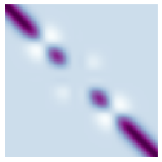
    


```python
# functions from new mu and covariance matrix
f_star = np.random.multivariate_normal(mu, var, 100)
f_star_mean = f_star.mean(axis=0)
f_star_std = f_star.std(axis=0)
```

<div style="background-color: #ccffcc; padding: 10px;">

Now we have our function prectitons `f_star`that intercepts all training points
</div>


```python
# plot predictions
fig, ax = plt.subplots(figsize=(10,5))
#plt.scatter(x, y, 100, 'k', 'o', zorder=100)
ax.scatter(x_samp, y_samp, s=50, c="C1", zorder=10)
ax.plot(x, f_star.T, color='C0', alpha=0.1)
# if you have altered the function you may need to alter the y lim
ax.set_xlim([-6,6])
ax.set_ylim([-10,15])
ax.set_xlabel("x")
ax.set_ylabel("f(x)")
plt.show()
```


    
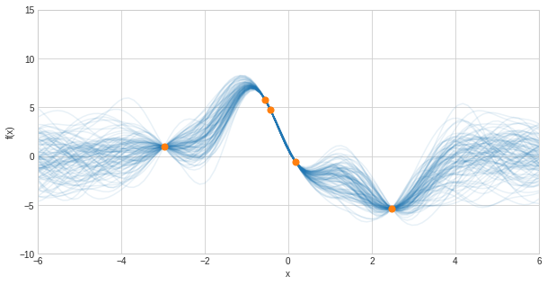
    


<div style="background-color: #ccffcc; padding: 10px;">

We can plot below the mean prediction function and the standard deviation. Away from training points the standard deviation is much higher. Reflecting the lack of knowledge in these areas. 
</div>


```python
fig, ax = plt.subplots(figsize=(10,5))
ax.scatter(x_samp, y_samp, s=50, c="C1", zorder=10)
ax.plot(x,y,color='r',alpha=0.2)
ax.plot(x, f_star_mean, color='C0')
ax.fill_between(x.flatten(), f_star_mean+f_star_std, f_star_mean-f_star_std, alpha=0.1, color='C0')
ax.set_xlim([-6,6])
# if you have altered the function you may need to alter the y lim
ax.set_ylim([-10,15])
ax.set_xlabel("x")
ax.set_ylabel("f(x)")
ax.legend(['actual','predicted'])
```


    <matplotlib.legend.Legend at 0x7fba6413de20>


    
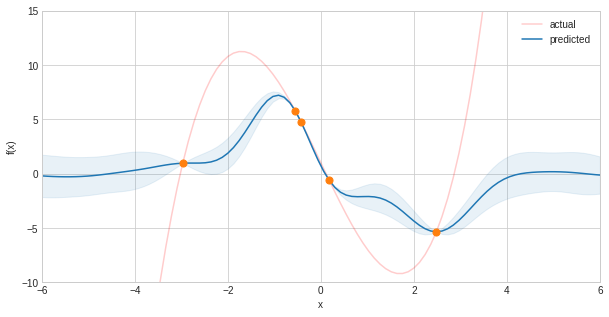
    


<div style="background-color: #ccffcc; padding: 10px;">
Since the RBF kernel is stationary it will always return to $\mu=0$ in regions further away from observed training data. This decreases the accuracy for predictions that reach further into the past or the future.
</div>

# Sea Level Example

<div style="background-color: #ccffcc; padding: 10px;">

Now let's look at an example using Gaussian Process to Predict sea level change using a subset of sea level data from RISeR dataset provided in python numpy arrays by Oliver Pollard.    

Example of a global RSL change output for the Last Glacial maximum to present (using the ICE-5G (Peltier et al., 2015) input to a implemented model (Han and Gomez, 2018) of sea level theory (Kendall et al., 2005)).
    
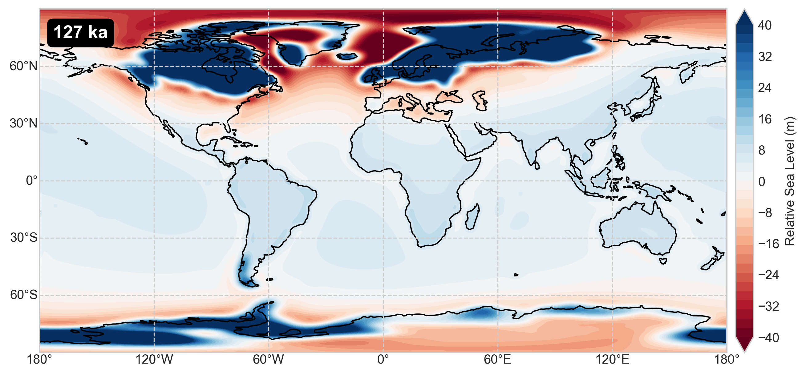

        
</div>

# Load Data 

<div style="background-color: #cce5ff; padding: 10px;">

For this example we're using data provided in python [.npy files](https://towardsdatascience.com/what-is-npy-files-and-why-you-should-use-them-603373c78883) containing relative sea level change at a single point in the southern north sea at 122 (ka). `highstand` data we will use to test our predictions 
    
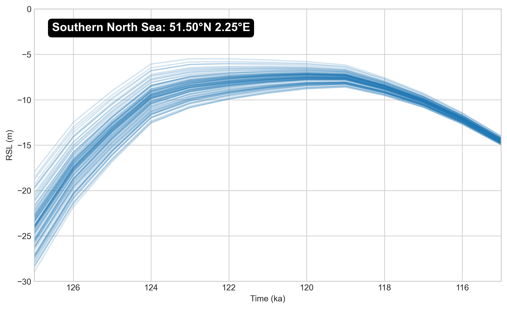
  
 </div>


```python
highstand = np.load("data/highstand_data.npy")
```

<div style="background-color: #cce5ff; padding: 10px;">
    
We can use 4 parameters provided in `parameter_data.npy` which correspond to the parameters listed below
 
The Rates of Interglacial Sea-level Change and Responses (RISeR) dataset covers the early interglaical period and can be used to show relative contribution to the Penultimate Glacial Period (PPGM) Max Ice
Volume and Last Interglacial (LIG) Highstnad from 4 parameters from seidment cores

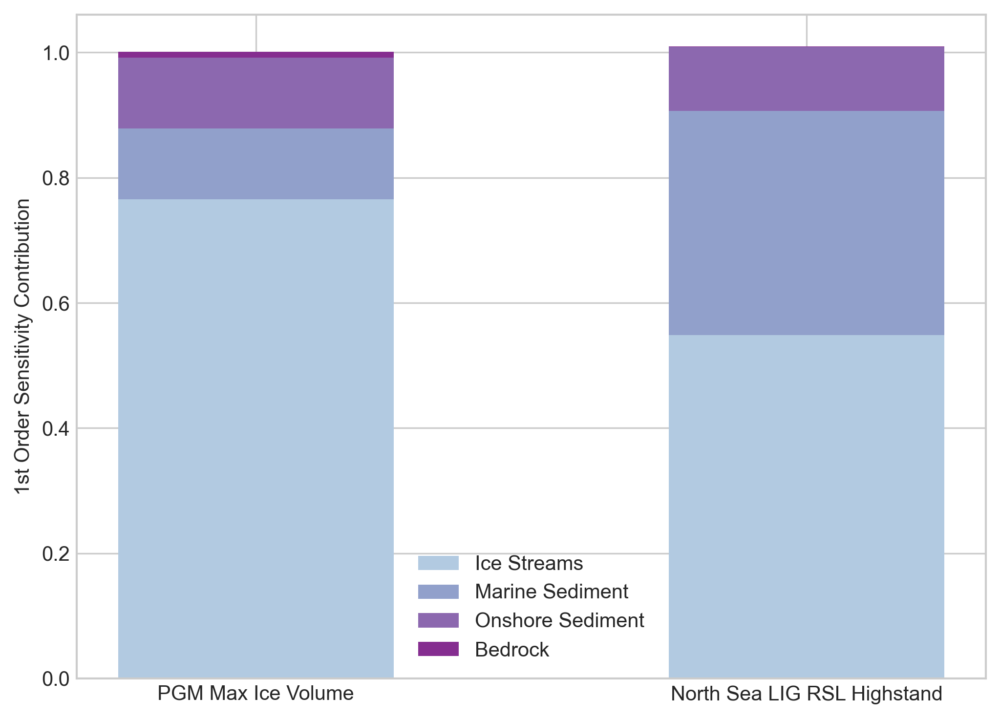

</div>


```python
parameters = np.load('data/parameter_data.npy')
```

# Normalise Data


```python
# useful functions
def stack_parameters(*parameters):
    return np.column_stack([[*parameters]]).T

def normalise(parameters):
    normalised_parameters = np.zeros_like(parameters)
    normalisation_values = []
    for index, parameter in enumerate(parameters.T):
        shift = - np.min(parameter)
        scale = np.max(parameter + shift)
        normalised_parameters[:,index] = (parameter + shift)/scale
        normalisation_values.append((shift, scale))
        
    return normalised_parameters, normalisation_values
    
```


```python
            
# move parameter ranges down to improve results
p1 = parameters[:,0] # Bedrock
p2 = parameters[:,1] # Onshore Sediment
p3 = parameters[:,2] # Marine Sediement
p4 = parameters[:,3] # Ice streams
parmlist = ['Bedrock','Onshore Sediment','Marine Sediement','Ice streams']
parameters = stack_parameters(p1, p2, p3, p4)
highstand = highstand.reshape(-1,1)

parameters_norm, parameters_norm_params = normalise(parameters)
highstand_norm, highstand_norm_params = normalise(highstand)
```

# Plot Data


```python
# plot data for parameter
scatter_fig = plt.figure(figsize=[16,10])
for index in range(4):
    ax = scatter_fig.add_subplot(221+index)
    ax.scatter(parameters_norm[:,index], highstand, s=15, c="#71a8ad")
    ax.set_title(f"{str(parmlist[index])}", fontsize=16, fontweight='bold')
    ax.set_ylabel("Highstand (m)")
```


    
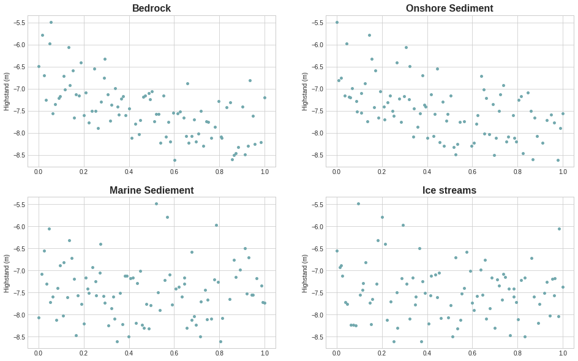
    


## Plot parameters against other parameters


```python
fig, ax = plt.subplots(nrows=4, ncols=4, figsize=(15,15))
for index_1 in range(4):
    for index_2 in range(4):
        if index_1 == index_2:
            ax[index_1, index_2].axis('off')
            ax[index_1, index_2].text(0.5,0.5,f"{str(parmlist[index_1])}",horizontalalignment="center",
                                      verticalalignment="center", fontsize=15, 
                                      fontweight='bold')
        elif index_2 < index_1:
            ax[index_1, index_2].axis('off')
            
        else:
            ax[index_1, index_2].scatter(parameters_norm[:,index_2], parameters_norm[:,index_1],s=2,c="red")
            ax[index_1, index_2].set_xlim([0,1])
            ax[index_1, index_2].set_ylim([0,1])
```


    
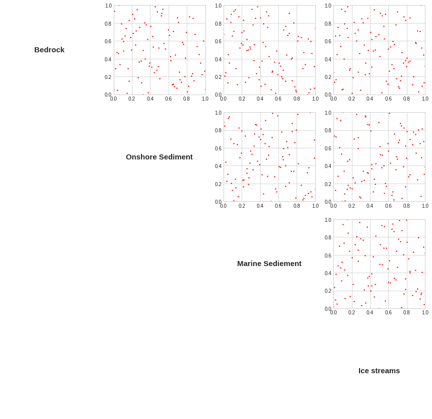
    


```python
# Over lay sparse points in red over the points to be predicted in blue
```


```python
predict_coords = np.load("data/predict_points.npy")
```


```python
fig, ax = plt.subplots(nrows=4, ncols=4, figsize=(15,15))
for index_1 in range(4):
    for index_2 in range(4):
        if index_1 == index_2:
            ax[index_1, index_2].axis('off')
            ax[index_1, index_2].text(0.5,0.5,f"{str(parmlist[index_1])}",
                                      horizontalalignment="center",
                                      verticalalignment="center", fontsize=15)
        elif index_2 < index_1:
            ax[index_1, index_2].axis('off')
            
        else:
            ax[index_1, index_2].scatter(predict_coords[:,index_2], predict_coords[:,index_1],s=2,c="C0", alpha=0.2)
            ax[index_1, index_2].scatter(parameters_norm[:,index_2], parameters_norm[:,index_1],s=2,c="red")
            ax[index_1, index_2].set_xlim([0,1])
            ax[index_1, index_2].set_ylim([0,1])
```


    
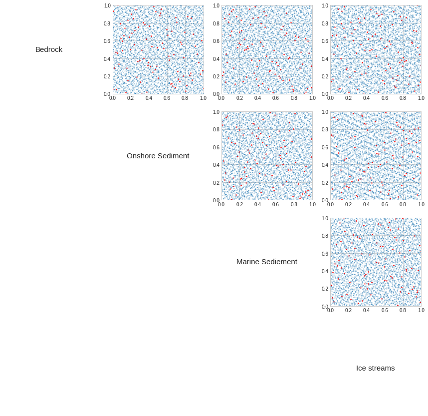
    


## Define GP flow model

<div style="background-color: #cce5ff; padding: 10px;">

We're going to use the python library [GP flow model](https://gpflow.readthedocs.io/en/master/notebooks/basics/regression.html) to create our guassian process model to creat a more complex model that in our previous example in less lines of code
    
`k = gpflow.kernels.Matern52(lengthscales=lscale)`  selects a [Matérn covariance function](https://en.wikipedia.org/wiki/Mat%C3%A9rn_covariance_function) for the [GP flow kernel](https://gpflow.readthedocs.io/en/master/notebooks/advanced/kernels.html)  

`m = gpflow.models.GPR(data=(X, Y), kernel=k, mean_function=None)` constructs a regression model from data points and the selected kernal. 

to inspect the chosen kernel you can run the `print_summary` command which should show you a list of hyperparamers: `variance` and `lengthscale` and will display information about those hyperparamters which will start at default values of 1 and the [transformation](https://en.wikipedia.org/wiki/Rectifier_(neural_networks)#Softplus) applied.

</div>


```python
gpflow.config.set_default_summary_fmt("notebook")
k = gpflow.kernels.Matern52(lengthscales=np.ones((len(parameters_norm.T))))
print_summary(k)
```

    2021-08-06 17:04:36.259272: W tensorflow/stream_executor/platform/default/dso_loader.cc:64] Could not load dynamic library 'libcuda.so.1'; dlerror: libcuda.so.1: cannot open shared object file: No such file or directory
    2021-08-06 17:04:36.259295: W tensorflow/stream_executor/cuda/cuda_driver.cc:326] failed call to cuInit: UNKNOWN ERROR (303)
    2021-08-06 17:04:36.259312: I tensorflow/stream_executor/cuda/cuda_diagnostics.cc:156] kernel driver does not appear to be running on this host (marvin): /proc/driver/nvidia/version does not exist
    2021-08-06 17:04:36.259531: I tensorflow/core/platform/cpu_feature_guard.cc:142] This TensorFlow binary is optimized with oneAPI Deep Neural Network Library (oneDNN) to use the following CPU instructions in performance-critical operations:  AVX2 FMA
    To enable them in other operations, rebuild TensorFlow with the appropriate compiler flags.


<table>
<thead>
<tr><th>name                 </th><th>class    </th><th>transform  </th><th>prior  </th><th>trainable  </th><th>shape  </th><th>dtype  </th><th>value         </th></tr>
</thead>
<tbody>
<tr><td>Matern52.variance    </td><td>Parameter</td><td>Softplus   </td><td>       </td><td>True       </td><td>()     </td><td>float64</td><td>1.0           </td></tr>
<tr><td>Matern52.lengthscales</td><td>Parameter</td><td>Softplus   </td><td>       </td><td>True       </td><td>(4,)   </td><td>float64</td><td>[1., 1., 1....</td></tr>
</tbody>
</table>


```python
m = gpflow.models.GPR(data=(parameters_norm, highstand_norm), kernel=k, mean_function=None)
print_summary(m)
```


<table>
<thead>
<tr><th>name                   </th><th>class    </th><th>transform       </th><th>prior  </th><th>trainable  </th><th>shape  </th><th>dtype  </th><th>value         </th></tr>
</thead>
<tbody>
<tr><td>GPR.kernel.variance    </td><td>Parameter</td><td>Softplus        </td><td>       </td><td>True       </td><td>()     </td><td>float64</td><td>1.0           </td></tr>
<tr><td>GPR.kernel.lengthscales</td><td>Parameter</td><td>Softplus        </td><td>       </td><td>True       </td><td>(4,)   </td><td>float64</td><td>[1., 1., 1....</td></tr>
<tr><td>GPR.likelihood.variance</td><td>Parameter</td><td>Softplus + Shift</td><td>       </td><td>True       </td><td>()     </td><td>float64</td><td>1.0           </td></tr>
</tbody>
</table>


## Optamization

<div style="background-color: #cce5ff; padding: 10px;">
    
`opt = gpflow.optimizers.Scipy()` uses the Scipy optimizer, which by default implements the [Limited Memory Broyden–Fletcher–Goldfarb–Shanno (L-BFGS-B)](https://en.wikipedia.org/wiki/Limited-memory_BFGS) algorithm
    
`opt.minimize(m.training_loss, m.trainable_variables, options=dict(maxiter=100))` calls the minimize method of an optimizer which uses the training_loss defined by the GPflow model and the variables to train with  and the number of iterations

</div>


```python
opt = gpflow.optimizers.Scipy()
opt.minimize(m.training_loss, m.trainable_variables, options=dict(maxiter=100))
print_summary(m)
```

    2021-08-06 17:04:36.305203: W tensorflow/python/util/util.cc:348] Sets are not currently considered sequences, but this may change in the future, so consider avoiding using them.
    2021-08-06 17:04:37.502617: I tensorflow/compiler/mlir/mlir_graph_optimization_pass.cc:176] None of the MLIR Optimization Passes are enabled (registered 2)
    2021-08-06 17:04:37.521594: I tensorflow/core/platform/profile_utils/cpu_utils.cc:114] CPU Frequency: 2099940000 Hz


<table>
<thead>
<tr><th>name                   </th><th>class    </th><th>transform       </th><th>prior  </th><th>trainable  </th><th>shape  </th><th>dtype  </th><th>value                                </th></tr>
</thead>
<tbody>
<tr><td>GPR.kernel.variance    </td><td>Parameter</td><td>Softplus        </td><td>       </td><td>True       </td><td>()     </td><td>float64</td><td>5.585300008757415                    </td></tr>
<tr><td>GPR.kernel.lengthscales</td><td>Parameter</td><td>Softplus        </td><td>       </td><td>True       </td><td>(4,)   </td><td>float64</td><td>[2.68187365, 3.66118876, 6.0572698...</td></tr>
<tr><td>GPR.likelihood.variance</td><td>Parameter</td><td>Softplus + Shift</td><td>       </td><td>True       </td><td>()     </td><td>float64</td><td>1.0129000087929017e-06               </td></tr>
</tbody>
</table>


## Prediction


<div style="background-color: #cce5ff; padding: 10px;">
    
`m.predict_f` predicts at the new points producing a mean and variance we'll create an array of predicted means `predict` and variance `predict_var` by looping over the normalised training data from our parameters     
</div>


```python
mean, var = m.predict_f(np.asarray([[0.2,0.5,0.6,0.7]]))
print(mean.numpy()[0][0], var.numpy()[0][0])
```

    0.45757607196216493 1.0797173022325524e-06


```python
mean, var = m.predict_f(predict_coords)
print(mean.numpy()[:,0], var)
```

    [0.26936465 0.23898022 0.40307934 ... 0.1817838  0.45073476 0.67439909] tf.Tensor(
    [[3.51209883e-06]
     [1.72735484e-06]
     [6.14494327e-06]
     ...
     [2.19200864e-06]
     [1.27022434e-05]
     [1.01863470e-05]], shape=(6000, 1), dtype=float64)


```python
def coords_flattern(*coords):
    meshs = np.meshgrid(*coords)
    return np.column_stack(([mesh.ravel() for mesh in meshs]))
```


```python
predict = []
predict_var = []
for index, point in enumerate(parameters_norm):
    parameters_norm_training = np.delete(parameters_norm, index, axis=0)
    highstand_norm_training = np.delete(highstand_norm, index, axis=0)
    
    k = gpflow.kernels.Matern52(lengthscales=np.ones((len(parameters.T))))
    m = gpflow.models.GPR(data=(parameters_norm_training, highstand_norm_training), kernel=k, mean_function=None)
    opt.minimize(m.training_loss, m.trainable_variables, options=dict(maxiter=100))
    
    lop = parameters_norm[index]
    meanp, varp = m.predict_f(coords_flattern([lop[0]],[lop[1]],[lop[2]],[lop[3]]))
    predict_var.append(varp.numpy()[0][0])
    predict.append(meanp.numpy()[0][0])
```

## Cross Validation


<div style="background-color: #cce5ff; padding: 10px;">
    
we can now plot our predicted values (`predict`) against our actual values (`highstand`) *normalised*
</div>


```python
fig, ax = plt.subplots(figsize=[6,6])
ax.plot(np.linspace(0,1,num=100), np.linspace(0,1,num=100), c="#031f1d")
ax.plot(highstand_norm, predict, 'x', c="#71a8ad")
ax.errorbar(highstand_norm, predict, yerr=predict_var, linestyle="None")
ax.set_ylabel("Predicted Highstand Normalised")
ax.set_xlabel("Actual Highstand Normalised")
```


    Text(0.5, 0, 'Actual Highstand Normalised')


    
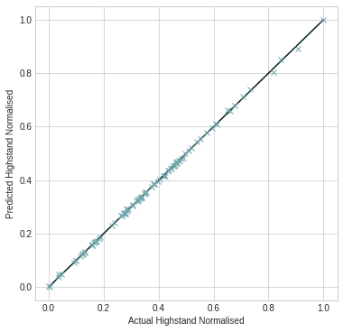
    


## Plot High Stands

<div style="background-color: #cce5ff; padding: 10px;">

We can now plot the actual predictions (`mean`) in purple with the grey dots agreemeny with the actual data (`highstand_norm`)    
</div>


```python
# plot data for parameter
scatter_fig = plt.figure(figsize=[16,10])
for index in range(4):
    ax = scatter_fig.add_subplot(221+index)
    ax.scatter(predict_coords[:,index], mean.numpy()[:,0], s=15, c="purple")
    ax.scatter(parameters_norm[:,index], highstand_norm, s=15, c="#71a8ad")
    ax.set_title(f"{str(parmlist[index])}", fontsize=16, fontweight='bold')
    ax.set_ylabel("Highstand (m)")
    plt.legend(['mean','highstand_norm'])
    
plt.tight_layout()
```


    
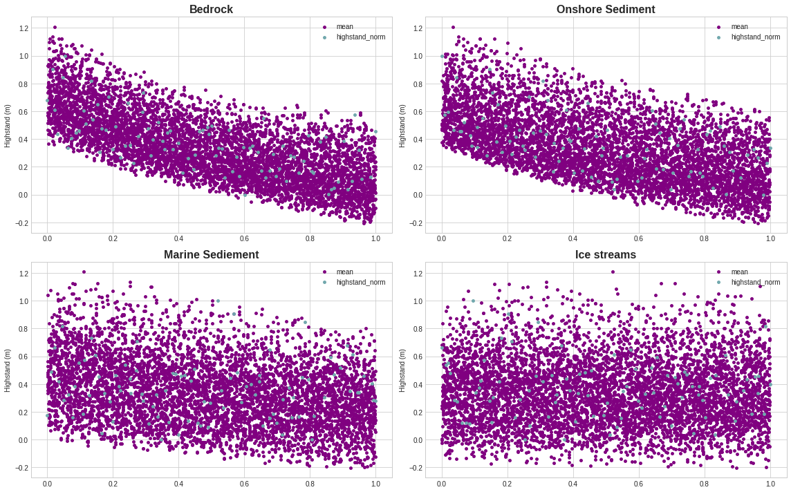
    


```python

```
