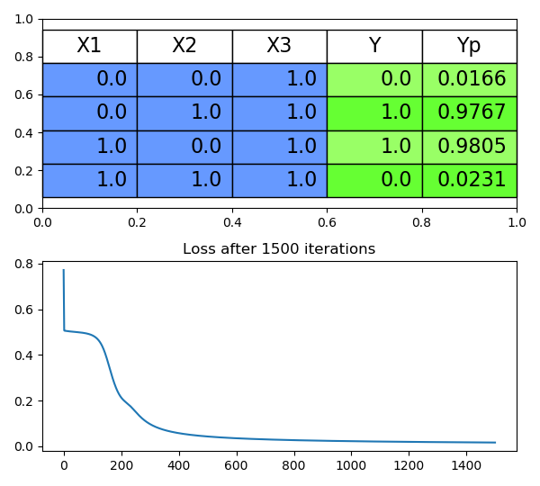

# [Build your own neural network](https://towardsdatascience.com/how-to-build-your-own-neural-network-from-scratch-in-python-68998a08e4f6)

Following the tutorial from James Loy (Georgia Tech):

A 2 layer neural network (a mathematical function that maps a given input to a desired output)

* An input layer **x** with an arbitrary amount of **hidden layers** and an output layer **y**
* You need a set of weights and biases **W** and **b**
* And an activation function **sigma**

The output of a 2 layer NeuralNetwork would be:

y = sigma ( Ws sigma(W1x +b1)+ b2)

The goal is to find the correct Ws and b - you need to "train" the network.

## Training ##

* **feedforword** calculate predicted y

The feedforword stage we use the input wieght, bias and activation function to calculate layer
1 and then you layer1 and the input to cumulate the output

We then use a "**Loss function**" to evaluated how close to y we got. E.g. Sum of squares error:

The idea is to find the best W and b values to reduce the loss function (get as close as possible to correct y)

**backpropagation** Updating the weights and biases

Now we must propagate the error back to find the weight and bias adjustment. find the derivative
(will tell you the direction to adjust to). (Gradient descent).

Loss(y,y_pred) - is not in terms of W and b so the chain rule must be applied:

# Results #

Using a very simple example scripted in PlaywithNN.py we can see this in action:

The predicted values are very close to our actual values and we can see the "Loss"
really dropping off after 1000 iterations. In fact there's little difference in the results between 1500 and 100000. But this is a very simple case.
