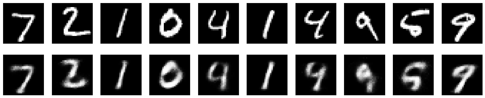
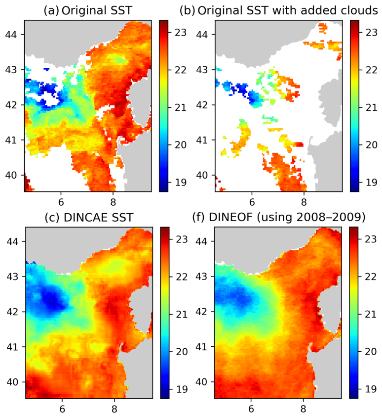

# LIFD Machine Learning For Earth Sciences

      

Leeds Institute for Fluid Dynamics (LIFD) has teamed up with the Center for Environmental Modelling and Computation (CEMAC) team to create 4 Jupyter notebook tutorials on the following topics.

1. [Convolutional Neural Networks](#Convolutional-Neural-Networks)
2. [Physics Informed Neural Networks](#Physics-Informed-Neural-Networks)
3. [Gaussian Processes](#Gaussian-Processes)
4. [Random Forests](#Random-Forests)
5. [GenerativeAdversarialNetworks](#GenerativeAdversarialNetworks)
6. [AutoEncoders](#AutoEncoders)

These notebooks require very little previous knowledge on a topic and will include links to further reading where necessary. Each Notebook should take about 2 hours to run through and should run out of the box home installations of Jupyter notebooks.

## How to Run

These notebooks can run with the resources provided and the anaconda environment setup. If you are familiar with anaconda, Juypter notebooks and GitHub. Simply clone this repository and run it within your Jupyter Notebook setup. Otherwise please read the [how to run](howtorun.md) guide.

# Convolutional Neural Networks

### [Classifying Volcanic Deformation](https://github.com/cemac/LIFD_ConvolutionalNeuralNetworks)

In this tutorial, we explore work done by Mattew Gaddes creating a Convolutional Neural Network that will detect and localise deformation in Sentinel-1 Interferogram. A database of labelled Sentinel-1 data hosted at [VolcNet](https://github.com/matthew-gaddes/VolcNet) is used to train the CNN.

# Physics Informed Neural Networks

### [1D Heat Equation and Navier Stokes Equation](https://github.com/cemac/LIFD_Physics_Informed_Neural_Networks)

Recent developments in machine learning have gone hand in hand with a large growth in available data and computational resources. However, often when analysing complex physical systems, the cost of data acquisition can be prohibitively large. In this small data regime, the usual machine learning techniques lack robustness and do not guarantee convergence.  

Fortunately, we do not need to rely exclusively on data when we have prior knowledge about the system at hand. For example, in a fluid flow system, we know that the observational measurements should obey the Navier-Stokes equations, and so we can use this knowledge to augment the limited data we have available. This is the principle behind physics-informed neural networks.

These notebooks illustrate using PINNs to explore the 1D heat equation and Navier Stokes Equation.  

In the Navier Stokes example notebook, sparse velocity data points (blue dots) are used to infer fluid flow patterns in the wake of a cylinder and unknown velocity and pressure fields are predicted using only a discrete set of measurements of a concentration field c(t,x,y).

These examples are based on work from the following two parers:
* M. Raissi, P. Peridakis, G. Karniadakis, Physics Informed Deep Learning (Part II): Data-driven Discovery of Nonlinear Partial Differential Equations, 2017
* M. Raissi, A. Yazdani, G. Karniadakis, Hidden Fluid Mechanics: A Navier-Stokes Informed Deep Learning Framework for Assimilating Flow Visualization Data, 2018

# Gaussian Processes
### [Exploring sea level change via Gaussian processes](https://github.com/cemac/LIFD_GaussianProcesses)

Gaussian Processes are a powerful, flexible, and robust machine learning technique applied widely for prediction via regression with uncertainty. Implemented in packages for many common programming languages, Gaussian Processes are more accessible than ever for application to research within the Earth Sciences. In the notebook tutorial, we explore Oliver Pollards Sea level change work using Gaussian Processes.

# Random Forests
### [Identifying controls on leaf temperature via random forest feature importance](https://github.com/cemac/LIFD_RandomForests)

This tutorial is based on work done by Chetan Deva on Using random forests to predict leaf temperature from a number of measurable features.

Plants regulate their temperature in extreme environments. e.g. a plant in a desert can stay 18C cooler than the air temp or 22 C warmer than the air in the mountains. Leaf temperature differs from air temperature. Plant growth and development is strongly dependent on leaf temperature. Most Land Surface Models (LSMs) & Crop growth models (CGMs) use air temperature as an approximation of leaf temperature.

However, during time periods when large differences exist, this can be an important source of input data uncertainty.

In this tutorial leaf data containing a number of features is fed into a random forest regression model to evaluate which features are the most important to accurately predict the leaf temperature differential.

# GenerativeAdversarialNetworks

[Generative Adversarial Networks](https://github.com/cemac/LIFD_GenerativeAdversarialNetworks)

Generative Adversarial Networks are a pair of Neural Networks that work to generate rather than predict. The example you've probably see in mainstream media is deepfakes, where the network has been trained to produce images of humans that are so good even humans can't tell the difference

Generative Adversarial Networks are made up of two Neural Networks: a generator and a discriminator. Both networks are equally bad at their respective tasks initially. As training continues, both networks compete with one another to get better at their respective tasks. Eventually, the generator becomes so good that humans can’t tell the difference (hopefully!)

Using PyTorch we can use the MNIST dataset to train a GAN to produce handwritten digits. Other applications of GANS are creating synthetic data such as generating synthetic tropical cyclone data ([https://github.com/MetOffice/ML-TC](https://github.com/MetOffice/ML-TC)), these can in turn be used to train other models.

# AutoEncoders

[AutoEncoders](https://github.com/cemac/LIFD_AutoEncoders)

AutoEncoders are unsupervised learning technique that performs data encoding and decoding using feed forward neural networks made of two components:

* **Encoder** translates input data into lower dimensional space. (lower dimensional encoding is referred to as the latent space representation) 	 

* **Decoder** tries to reconstruct the original 	data from the lower dimensional data 	 

This can be used in simple examples such as encoding and decoding the MNSIT dataset or de-noising noisy digits. Which can then be applied for things such as using Auto Encoders to infill data for example in the case of Barth et al. 2020 they can earn non-linear, stochastic features measured at sea surface by satellite sensors so their use proves efficient in retaining small-scale structures that more traditional methods may remove / smooth out.

References:

*Barth et al 2020, Geoscientific Model Development: DINCAE 1.0: a convolutional neural network with error estimates to reconstruct sea surface temperature satellite observations.*

## Contributions

We hope that this resource can be built upon to provide a wealth of training material for Earth Science Machine Learning topics at Leeds

# Licence information #

 LIFD_ENV_ML_NOTEBOOKS by <a xmlns:cc="http://creativecommons.org/ns#" href="http://cemac.leeds.ac.uk/" property="cc:attributionName" rel="cc:attributionURL">cemac</a> is licensed under a <a rel="license" href="http://creativecommons.org/licenses/by/4.0/">Creative Commons Attribution 4.0 International License</a>.

## Acknowledgements

*Leeds Institute of Fluid Dynamics*, *CEMAC*, *Matthew Gaddes*, *Oliver Pollard*, *Chetan Deva*, *Fergus Shone*, *Michael MacRaild*, *Phil Livermore*, *Giulia Fedrizzi*, *Eszter Kovacs*, *Ana Reyna Flores*, *Francesca Morris*, *Emma Pearce*, *Maeve Murphy Quinlan*, *Sara Osman*, *Jonathan Coney*, *Eilish O'grady*, *Leif Denby*, *Sandra Piazolo*, *Caitlin Howath*, *Claire Bartholomew*, *Anna Hogg* and *Ali Gooya*
